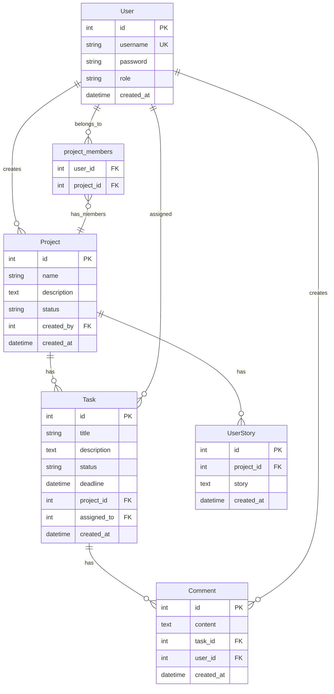

# Project Management Tool - ER Diagram

## Entity Relationships

### One-to-Many Relationships:
- **User → Project**: One user can create many projects (`created_by`)
- **Project → Task**: One project can have many tasks
- **Project → UserStory**: One project can have many user stories
- **Task → Comment**: One task can have many comments
- **User → Task**: One user can be assigned to many tasks (`assigned_to`)
- **User → Comment**: One user can create many comments

### Many-to-Many Relationships:
- **User ↔ Project**: Users can be team members of multiple projects, and projects can have multiple team members
  - Implemented via `project_members` junction table with explicit relationships:
    - User → project_members (one user can belong to many project memberships)
    - project_members → Project (one project membership belongs to one project)

## Key Constraints

- **Primary Keys**: All entities have auto-incrementing integer primary keys
- **Foreign Keys**: Properly defined with referential integrity
- **Unique Constraints**: Username must be unique
- **Not Null**: Essential fields are marked as not nullable
- **Default Values**: Status fields have sensible defaults ('todo', 'active')

## Database Schema Details

### User Table
- Stores authentication and role information
- Roles: 'admin', 'manager', 'developer'

### Project Table
- Central entity for project management
- Tracks project metadata and status

### Task Table
- Core work items within projects
- Status progression: 'todo' → 'in_progress' → 'done'
- Deadline tracking for overdue detection

### Comment Table
- Enables collaboration on tasks
- Audit trail of task discussions

### UserStory Table
- Stores AI-generated user stories
- Linked to projects for context

### Junction Table (project_members)
- Manages many-to-many relationship between users and projects
- Enables team assignment functionality
- Each record represents one user's membership in one project</content>
<parameter name="filePath">g:\project-management-tool\ER_DIAGRAM.md